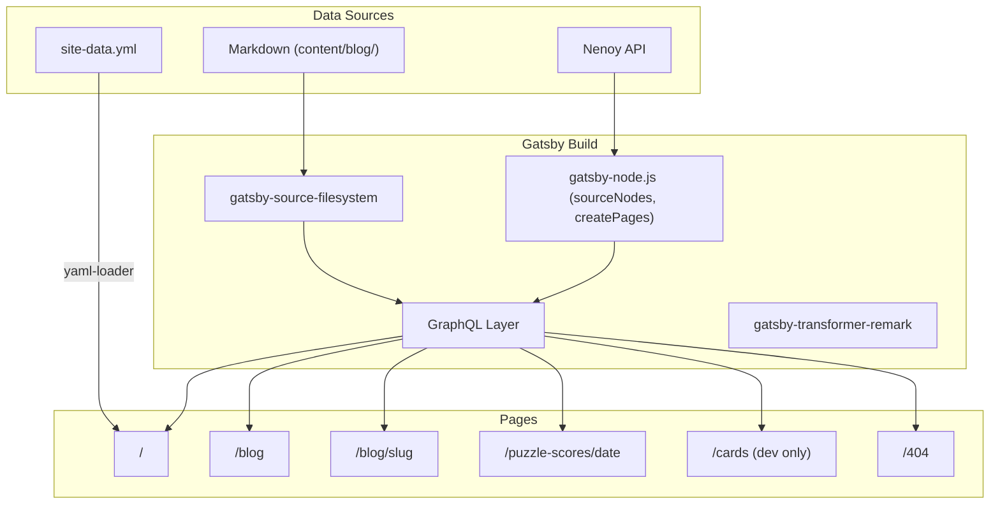
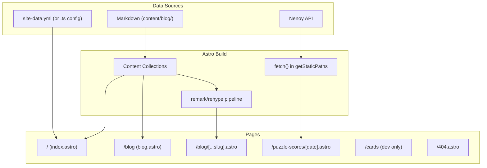

# Gatsby v4 to Astro Migration Plan

## Current Architecture




## Target Architecture




---

## General Principle

**The goal of this migration is to replicate the exact appearance and behavior of the Gatsby site.** Do not silently substitute, simplify, or omit any visual element (icons, fonts, animations, layout, etc.) during migration. If a 1:1 replacement is not straightforward, flag it and discuss alternatives before proceeding. Any intentional visual or behavioral changes should be tracked separately (e.g., in `FUTURE_IMPROVEMENTS.md`) and done outside this migration.

---

## Verification Strategy

Work happens on a long-lived `astro-migration` branch. Each milestone is merged into this branch and auto-deployed to a Netlify branch deploy URL for visual verification.

**Setup:**

- Create branch `astro-migration` from `main`
- Add `netlify.toml` on this branch to override the build for branch deploys:

```toml
[context.branch-deploy]
  command = "npx astro build"
  publish = "dist"
```

- In Netlify UI: Site settings > Build & deploy > Branches and deploy contexts > add `astro-migration` to branch deploys
- This gives a stable preview URL: `astro-migration--{sitename}.netlify.app`
- `main` continues to build and deploy the Gatsby site as normal until final cutover

**After each milestone:**

- Run `npm run check-format` (Prettier) and fix any formatting issues
- Run any existing tests if available
- Stop and hand off for manual testing, committing, and verifying the branch deploy

**What each milestone deploy looks like:**

- Milestone 0: Build passes, empty site
- Milestone 1: 404 page with correct fonts, colors, and layout
- Milestone 2: `/blog` and `/blog/{slug}` pages rendering with full styling
- Milestone 3: Homepage with all interactive sections (hero, about, contact, animations)
- Milestone 4: `/puzzle-scores/{date}` pages, `/puzzle-scores` redirect
- Milestone 5: `/cards` routes working in dev (not visible in deploy)
- Milestone 6: Ackee tracking active, Twitter embeds rendering
- Milestone 7: Final site -- merge `astro-migration` to `main`, switch production
- Milestone 8: All code blocks render with Night Owl colors and line highlighting

---

## Milestone 0: Branch Setup

Create the `astro-migration` branch and configure Netlify branch deploys.

- Create branch from `main`
- Add `netlify.toml` with branch-deploy build context (see above)
- Configure Netlify branch deploy in UI

---

## Milestone 1: Foundation + First Visible Page

**Goal:** Astro builds and deploys a styled 404 page.

### 1a. Project Scaffolding

Set up Astro alongside the existing Gatsby files. Both coexist temporarily.

**Files to create:**

- `astro.config.mjs` -- React integration, markdown config (Prism or Shiki for syntax highlighting, remark-images equivalent)
- `tsconfig.json` (Astro default)

**Files to modify:**

- `[package.json](package.json)` -- Add Astro and its integrations, keep Gatsby deps until cleanup

**Astro integrations needed:**

- `@astrojs/react` -- for interactive islands (burger menu, share buttons, scroll animations)
- `astro` core -- has built-in markdown support with remark/rehype
- No `@astrojs/netlify` needed -- the site is fully static (`output: 'static'`). Netlify serves the `dist/` folder directly.

**Key config decisions:**

- Syntax highlighting: Astro ships Shiki by default, but can switch to Prism to match the existing Night Owl theme via `markdown.syntaxHighlight: 'prism'`
- Image optimization: Astro's built-in `astro:assets` replaces `gatsby-plugin-image` and `gatsby-plugin-sharp`
- SVG imports: Use `astro-icon` or `vite-plugin-svgr` to replace `gatsby-plugin-react-svg`

### 1b. Content Collections

Set up before any pages, since blog pages depend on this.

**Define collection schema** in `src/content/config.ts`:

```typescript
import { defineCollection, z } from 'astro:content';

const blog = defineCollection({
  type: 'content',
  schema: ({ image }) => z.object({
    title: z.string(),
    datePublished: z.string(),
    teaser: z.string(),
    sharingCard: image().optional(),
  }),
});

export const collections = { blog };
```

- Move `content/blog/` to `src/content/blog/` (Astro requires content collections under `src/content/`)
- Handle remark images: configure `remarkPlugins` in `astro.config.mjs` or rely on Astro's built-in image handling
- Handle linked files (SVGs in blog posts): configure remark plugin or adjust image references

### 1c. Global Styles

Convert Emotion-based styling to plain CSS.

- Extract `[src/styles/GlobalStyles.js](src/styles/GlobalStyles.js)` into a `src/styles/global.css` file (font-face, CSS variables, base styles are already CSS -- just remove the Emotion wrapper)
- Extract `[src/styles/theme.js](src/styles/theme.js)` colors into CSS custom properties in `:root` (already partially done in GlobalStyles)
- Convert breakpoints from JS (`breakpoint.media4`, etc.) to plain CSS media queries -- document the mapping:
  - `media4` = `@media (min-width: 480px)`
  - `media7` = `@media (min-width: 768px)`
  - `media9` = `@media (min-width: 992px)`
  - `media12` = `@media (min-width: 1200px)`
- Convert Emotion styled components in `[src/styles/Containers.js](src/styles/Containers.js)`, `[src/styles/Headings.js](src/styles/Headings.js)`, `[src/styles/Links.js](src/styles/Links.js)`, `[src/styles/Buttons.js](src/styles/Buttons.js)`, `[src/styles/Lists.js](src/styles/Lists.js)` into reusable CSS classes in global CSS or scoped styles
- Move `[src/styles/prismjs-night-owl.css](src/styles/prismjs-night-owl.css)` as-is (already plain CSS)
- Convert `[src/styles/BlogStyles.js](src/styles/BlogStyles.js)` and `[src/styles/DailyPuzzleStyles.js](src/styles/DailyPuzzleStyles.js)` into plain CSS files
- Convert `[src/styles/TransitionStyles.js](src/styles/TransitionStyles.js)` into plain CSS

### 1d. Base Layout

- Create `src/layouts/BaseLayout.astro`:
  - `<head>` with charset, viewport, title, favicons, theme-color, OG/Twitter meta (replaces `[src/components/helmet.js](src/components/helmet.js)`)
  - Font preload links (replaces `[gatsby-ssr.js](gatsby-ssr.js)`)
  - Import `global.css` and `prismjs-night-owl.css` (replaces `[gatsby-browser.js](gatsby-browser.js)`)
  - `<Header />`, `<main>`, `<Footer />` structure
  - Accept props: `title`, `description`, `pageUrl`, `sharingCard`, `sharingAltText`

### 1e. 404 Page

- Migrate `src/pages/404.js` -> `src/pages/404.astro`
- Simple static page using `BaseLayout.astro`
- **Deploy checkpoint:** 404 page visible with correct fonts, colors, and layout

---

## Milestone 2: Blog

**Goal:** Blog index and individual blog post pages render with full styling.

### 2a. Static Blog Components

Convert presentational React components needed for blog pages to `.astro` files.

- `bio.js` -> `Bio.astro` -- Replace `StaticImage` with Astro `<Image />` from `astro:assets`
- `footer.js` -> `Footer.astro` -- Drop IntersectionObserver (purely cosmetic), use scoped CSS
- `post-preview.js` -> `PostPreview.astro` -- Replace Gatsby `Link` with `<a>`
- `post-details.js` -> `PostDetails.astro` -- Static display, scoped CSS
- `suggested-post.js` -> `SuggestedPost.astro` -- Replace Gatsby `Link` with `<a>`
- `engage.js` -- Keep as React island (uses `react-share`), render with `client:visible`

### 2b. Blog Index

- Migrate `src/pages/blog.js` -> `src/pages/blog.astro`
- Use `getCollection('blog')` to get all posts, sort by `datePublished`, limit to 6
- Render `Bio.astro` and `PostPreview.astro` list
- Note: Astro content collections don't provide `timeToRead` out of the box -- add `reading-time` remark plugin or calculate manually

### 2c. Blog Posts

- Migrate `src/templates/blog-post.js` -> `src/pages/blog/[...slug].astro`
- `getStaticPaths()` returns all blog slugs with prev/next context
- Render post HTML, `PostDetails`, `Engage` (React island), `SuggestedPost`
- Import blog-specific CSS (converted from `[src/styles/BlogStyles.js](src/styles/BlogStyles.js)`)
- **Deploy checkpoint:** `/blog` shows post list, `/blog/{slug}` shows full posts with code highlighting, share buttons, prev/next navigation

---

## Milestone 3: Homepage

**Goal:** Full interactive homepage with animations and scroll effects.

### 3a. React Islands

Refactor interactive components as React islands. Keep as `.jsx` files, rendered with `client:`* directives.

- `header.js` (`client:load`) -- Scroll-based shadow, burger menu toggle, state management
- `hero.js` (`client:load`) -- CSSTransition entrance animation, IntersectionObserver
- `about.js` (`client:visible`) -- IntersectionObserver appearance animation
- `contact.js` (`client:visible`) -- IntersectionObserver appearance animation
- `latest-blog-posts.js` (`client:visible`) -- IntersectionObserver appearance (refactor to receive posts as props instead of `useStaticQuery`)
- `section-markers.js` (`client:idle`) -- Scroll-based active section tracking
- `nav-overlay.js` (`client:load`) -- Mobile menu (toggled by header)
- `loader.js` (`client:load`) -- Entrance animation

**Important refactors for React islands:**

- Remove all `useStaticQuery` / GraphQL -- pass data as props from Astro parent
- Remove Emotion `css` prop -- use inline styles, CSS modules, or className-based styling
- Remove `gatsby-plugin-anchor-links` -- use plain anchor links or a small scroll utility
- `LatestBlogPosts` must receive the posts array as props (data fetched in the Astro page)

### 3b. Supporting Static Components

- `icon-link.js` -> `IconLink.astro` -- Replace `react-icons` with inline SVGs or `astro-icon`
- `nav-list.js` -> `NavList.astro` -- Replace `AnchorLink` with plain `<a href="#section">`

### 3c. Homepage Page

- Migrate `src/pages/index.js` -> `src/pages/index.astro`
- Import `BaseLayout.astro`
- Load site data from config (direct import of YAML, or convert to `.ts`)
- Compose sections: `Loader`, `Header`, `Hero`, `About`, `LatestBlogPosts`, `Contact`, `SectionMarkers`, `Footer`
- Interactive components rendered as React islands with `client:`* directives
- **Deploy checkpoint:** Full homepage with loader animation, hero entrance, scroll-triggered sections, burger menu, section markers

---

## Milestone 4: Puzzle Scores

**Goal:** Puzzle score pages with API data, navigation, and redirect.

### 4a. Puzzle Score Components

- `link-preview-card.js` -> `LinkPreviewCard.astro` -- Static card, plain ``
- `pair-label.js` -> `PairLabel.astro` -- Static display
- `puzzle-scores-nav.js` -> `PuzzleScoresNav.astro` -- Replace Gatsby `Link` with `<a>`
- Keep `react-twemoji` as-is inside the puzzle scores React island

### 4b. Puzzle Score Pages

- Migrate `src/templates/puzzle-scores.js` -> `src/pages/puzzle-scores/[date].astro`
- `getStaticPaths()` fetches from Nenoy API (replaces `sourceNodes` in `gatsby-node.js`)
- Process link previews (NYT Mini Crossword URL parsing) in `getStaticPaths`
- Import puzzle-specific CSS (converted from `[src/styles/DailyPuzzleStyles.js](src/styles/DailyPuzzleStyles.js)`)

### 4c. Puzzle Scores Redirect

- Create `src/pages/puzzle-scores/index.astro` that fetches the latest date from the API at build time and renders a `<meta http-equiv="refresh">` redirect to `/puzzle-scores/{latestDate}`
- **Deploy checkpoint:** `/puzzle-scores` redirects to latest date, individual date pages render with scores, emoji, link previews, and prev/next navigation

---

## Milestone 5: Sharing Cards

**Goal:** Dev-only sharing card routes and Puppeteer generation script.

- Create `src/pages/cards/index.astro` and `src/pages/cards/[...slug].astro` (dev-only routes)
- Migrate sharing card templates (`[src/templates/sharing-card.js](src/templates/sharing-card.js)`, `[src/templates/sharing-card-blog.js](src/templates/sharing-card-blog.js)`)
- Update `[scripts/generate-sharing-cards.js](scripts/generate-sharing-cards.js)` to use Astro's dev server URL instead of Gatsby's
- **Deploy checkpoint:** Not visible in deploy (dev-only), verify locally

---

## Milestone 6: Analytics & Third-Party

**Goal:** Ackee tracking and Twitter embeds working identically to Gatsby.

All three replacements below preserve identical behavior to the Gatsby plugins.

- **Ackee tracker**: Replace `gatsby-plugin-ackee-tracker` with a `<script>` tag in `BaseLayout.astro` using the same `ackee-tracker` vanilla JS library with the same options (`domainId`, `server`, `ignoreLocalhost`, `ignoreOwnVisits`, `detailed`)
- **Twitter embeds**: Replace `gatsby-plugin-twitter` with `<script async src="https://platform.twitter.com/widgets.js">` in `BaseLayout.astro`. This is exactly what the Gatsby plugin does under the hood -- it finds `<blockquote class="twitter-tweet">` elements in blog post HTML and hydrates them into interactive embeds. Currently used in one blog post (`why-my-blog-is-built-with-gatsby/index.md`).
- **Twemoji**: Keep `react-twemoji` as-is inside the puzzle scores React island. No migration needed -- it continues to work inside React islands.
- **Deploy checkpoint:** Ackee dashboard shows tracking from branch deploy URL, Twitter embed renders in the "Why My Blog Is Built with Gatsby" post

---

## Milestone 7: Cleanup & Production Cutover

**Goal:** Remove all Gatsby artifacts, merge to main, switch production build.

**Remove Gatsby artifacts:**

- Delete `gatsby-config.js`, `gatsby-node.js`, `gatsby-browser.js`, `gatsby-ssr.js`
- Remove all `gatsby-`* packages from `package.json`
- Remove `@emotion/react`, `@emotion/styled`, `gatsby-plugin-emotion`
- Remove `react-helmet`, `gatsby-plugin-react-helmet`
- Remove `yaml-loader` (Astro/Vite handles YAML natively with a plugin, or convert to TS)
- Remove `gatsby-plugin-anchor-links`
- Keep `@researchgate/react-intersection-observer` -- it's a standalone React library (not Gatsby-specific) and is already used by the React island components (Hero, About, Contact, LatestBlogPosts, Footer)

**Update scripts:**

- `package.json` scripts: `astro dev`, `astro build`, `astro preview`
- Update `[scripts/new-post.js](scripts/new-post.js)` to create posts in `src/content/blog/` instead of `content/blog/`

**Update CI:**

- Update `[.circleci/config.yml](.circleci/config.yml)` build command from `gatsby build` to `astro build`

**Deployment:**

- Remove the branch-deploy `netlify.toml` overrides (or update to be the default build)
- Update Netlify production build command to `npx astro build`, publish directory to `dist/`
- No adapter needed -- fully static site. `gatsby-plugin-netlify`'s auto-generated caching/security headers can be replicated with a `public/_headers` or `netlify.toml` if needed, or rely on Netlify defaults.

**Final cutover:**

- Merge `astro-migration` branch to `main`
- Production site now builds with Astro

---

## Milestone 8: Syntax Highlighting (Prism -> Shiki)

**Goal:** Restore full syntax highlighting parity with the Gatsby site, including line highlighting.

**Background:** Gatsby used `gatsby-remark-prismjs` which supported:

- Language-based syntax highlighting
- Line highlighting via `{1,2,4}` notation after the language tag (e.g., ``

```bash{1,2,4} ``)

- Line numbers (`showLineNumbers: true`)
- Night Owl theme via `prismjs-night-owl.css`
- Wrapper `<div class="gatsby-highlight">` with custom styling

Astro's built-in Prism mode does not support the `{1,2,4}` line highlighting syntax and treats it as part of the language name, breaking both highlighting and line markers.

### Option A: Switch to Shiki (recommended)

Shiki is Astro's default and preferred syntax highlighter. It runs at build time, outputs pre-colored HTML (zero client-side JS), and uses VS Code's TextMate grammar engine for accurate highlighting.

- Remove `syntaxHighlight: "prism"` from `astro.config.mjs` (Shiki is the default)
- Configure the `night-owl` theme (built into Shiki): `shikiConfig: { theme: 'night-owl' }`
- Add `@shikijs/transformers` and configure `transformerMetaHighlight()` to support `{1,2,4}` line highlighting syntax
- Replace `prismjs-night-owl.css` Prism token styles with Shiki-compatible styles (Shiki inlines colors, so most token styles are not needed)
- Add CSS for Shiki's line highlighting (`.line.highlighted` or equivalent)
- Replicate the `.gatsby-highlight-code-line` appearance (left border accent, background highlight)
- Replicate the `.gatsby-highlight` container styling (background, border-radius, margins, scrolling)
- Update selectors from `pre[class*='language-']` / `code[class*='language-']` to Shiki's output selectors (`.astro-code` / `pre > code`)

### Option B: Stay with Prism using `rehype-prism-plus`

If Shiki's output doesn't match the Gatsby appearance closely enough, `rehype-prism-plus` is a drop-in rehype plugin that extends Prism with the features `gatsby-remark-prismjs` had.

- Install `rehype-prism-plus` and add it to `astro.config.mjs` via `markdown.rehypePlugins`
- Set `syntaxHighlight: false` in Astro config (let the rehype plugin handle it instead)
- `rehype-prism-plus` supports the `{1,2,4}` line highlighting syntax, line numbers, and outputs Prism-compatible CSS classes
- The existing `prismjs-night-owl.css` can be reused with minimal changes (replace `.gatsby-highlight-code-line` with the plugin's equivalent class)

### 8b. Choose approach and implement

- Try Option A first (Shiki) since it's Astro-native and lower maintenance
- Fall back to Option B if visual fidelity with the Gatsby site is hard to achieve with Shiki

### 8c. Clean up workaround

- Remove `src/plugins/remark-strip-line-meta.mjs` (temporary remark plugin that strips `{n}` notation from code fence language tags so Prism doesn't break)
- Remove the `remarkPlugins: [remarkStripLineMeta]` entry from `astro.config.mjs`

### 8d. Verify

- Check all blog posts for correct syntax highlighting
- Verify line highlighting works on posts that use `{1,2,4}` notation
- Verify inline code styling is preserved
- **Deploy checkpoint:** All code blocks render with Night Owl colors, highlighted lines have accent border

---

## Plugin/Feature Migration Reference

- `gatsby-source-filesystem` + `gatsby-transformer-remark` -> Astro Content Collections
- `gatsby-remark-images` -> Astro image optimization or `remark-images`
- `gatsby-remark-prismjs` -> Shiki (Astro default) with `night-owl` theme + `@shikijs/transformers` for line highlighting (Milestone 8)
- `gatsby-remark-copy-linked-files` -> Handle in remark plugin or manual asset management
- `gatsby-plugin-image` / `gatsby-plugin-sharp` -> `astro:assets` `<Image />` component
- `gatsby-plugin-react-svg` -> `astro-icon` or Vite SVG plugin
- `gatsby-plugin-emotion` -> Not needed (using scoped/global CSS)
- `gatsby-plugin-react-helmet` -> Astro `<head>` in layouts
- `gatsby-plugin-netlify` -> Not needed -- use `public/_headers` for Netlify-specific config if needed
- `gatsby-plugin-anchor-links` -> Native `<a href="#id">` with `scroll-behavior: smooth`
- `gatsby-plugin-twitter` -> Twitter embed `<script>` tag
- `gatsby-plugin-ackee-tracker` -> Ackee vanilla JS `<script>`
- GraphQL `useStaticQuery` -> Direct imports / props from Astro pages
- `gatsby-node.js` `createPages` -> `getStaticPaths()` in dynamic route files
- `gatsby-node.js` `sourceNodes` -> `fetch()` in `getStaticPaths()`

