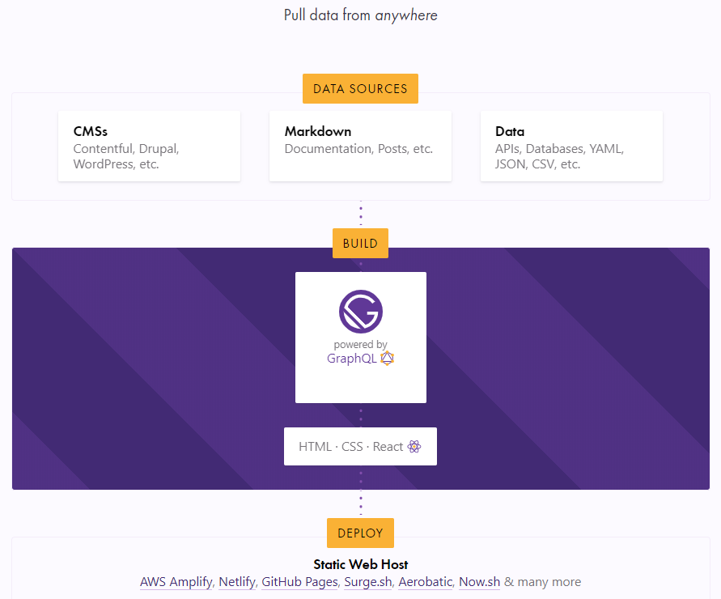

I decided to start this blog. It's the perfect medium to share and solidify my understanding of the things I learn. It's also an awesome way to learn [Gatsby](https://www.gatsbyjs.org/).

## What's Gatsby?

You might already know that Gatsby is a React-based static site generator. With static sites, pages are _pre_-generated at deploy time instead of rendering them on-demand on the server or client side.

Imagine living in a world where the only way to know the menu of a fastfood restaurant is to ask the cashier. The cashier, unaware of what's available, asks the chef back at the kitchen. The chef then shouts all the available items. The cashier lists all of them in a piece of paper and shows it to you. This buffoonery is repeated for every customer coming in. WTF, right?

In the real world, that's exactly what happens with dynamic websites. You request for a page. The server or the client fetches data from a source and renders the page.

This approach is great for content that changes frequently. Stock prices, airline seats, NBA scores. But for fastfood menu? Not so much.

Going back to our fake world, the staff could have just written the menu from the moment they opened. And then whenever something changed, they could just rewrite a new menu. This way, a lot of time is saved and whatever menu they show you is always updated.

This is how static site generators like Gatsby operate. Instead of re-rendering a page for every request, Gatsby builds pages as static files, ready to be deployed. Pages can be rendered again once there are changes in content, data or appearance. This is ideal for sites with content that doesn't change frequently (i.e. no real-time data) like business landing pages, eCommerce catalogs, documentation, blogs, [etc](https://www.gatsbyjs.org/showcase/). (As long as the time it takes to build and deploy pages is shorter than the rate at which the data changes, this approach is still ideal. Gatsby builds are fast and getting faster.)

## How it works

This nice illustration from the [Gatsby](https://www.gatsbyjs.org/) homepage sums it up.

Your data that can come from pretty much any source: Markdown files, APIs, [headless CMS](https://headlesscms.org) (basically a frontend-less CMS), and even a combination of multiple sources. During build, Gatsby pulls them from those sources, transforms them into a usable form if you want to, and makes the data available for access via [GraphQL](https://graphql.org/).

Then, you define expressive GraphQL queries to get the data you need and use them to create pages the way you like it using HTML, CSS and [React](https://reactjs.org/). Gatsby generates static pages based on these and you can deploy them to your favorite static web host. They are awesome and they worry about maintenance, security and [content delivery](https://en.wikipedia.org/wiki/Content_delivery_network), making deployment a walk in the park.

## Why I chose Gatsby

The static site approach brings a lot of benefits to the table. Apart from the obvious performance advantages, potential intruders have small surface of attack since there is no running server or database. It is also more SEO-friendly since static pages are easily crawled by search engine bots. 

For this blog, going with a static site was a no-brainer. But there are [a lot](https://www.staticgen.com/) of static site generators to choose from. The decision all boiled down to personal preference.

### Tech stack

My interest and familiarity with the JavaScript ecosystem lead me to Gatsby. I wanted to create my pages with React because I was familiar with it and at the same time, I still have a lot to learn about it. GraphQL is also an enticing tech that I wanted to get more comfortable with.

Might I add that I also follow JavaScript stans on Twitter and the hype was infectious.

<!--
    Setting up `gatsby-source-filesystem` allows you to query file nodes through GraphQL. It adds these fields:
        - allFile
        - directory
        - file
-->

<!-- 
    Doing a GraphQL query in a page
-->

<!--
Source plugins pull data from a data source into the Gatsby data system.
Transformer plugins transform this raw data into something more usable
-->

<!--

-->