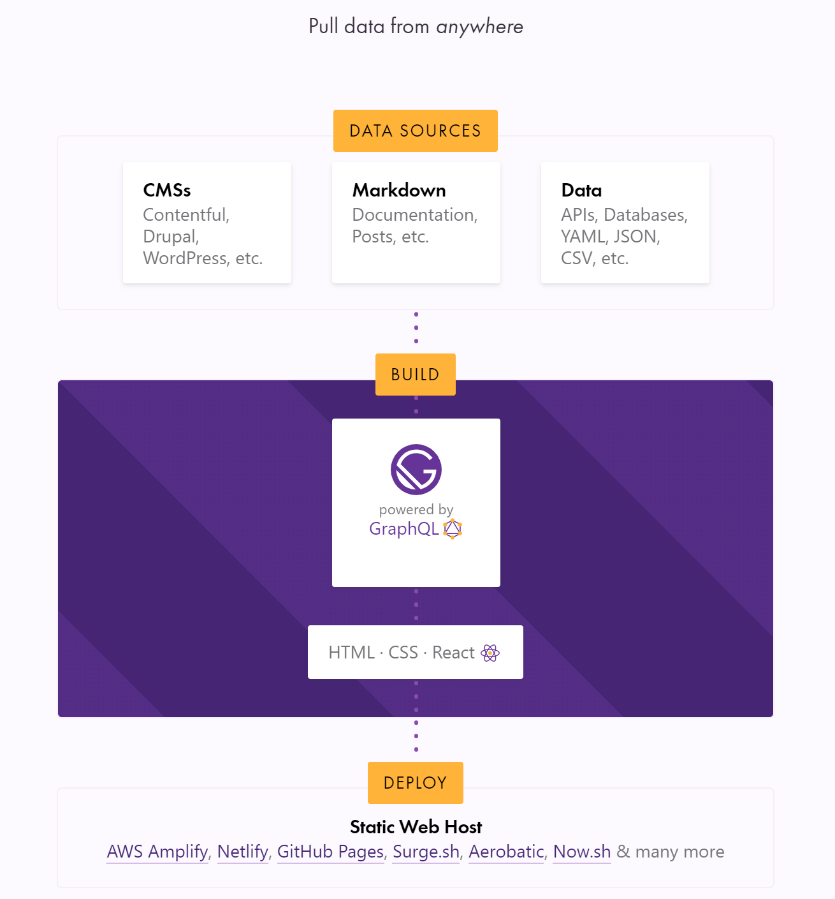

I decided to start this blog. It's the perfect medium to share and solidify my understanding of the things I learn. It's also an awesome way to learn [Gatsby](https://www.gatsbyjs.org/).

## What's Gatsby?

You might already know that Gatsby is a React-based static site generator (SSG). With static sites, pages are _pre_-generated at deploy time instead of rendering them on-demand on the server or client side.

Imagine living in a world where the only way to know the menu of a fastfood restaurant is to ask the cashier. Unaware of what's available, the cashier asks the chef back at the kitchen. The chef then shouts all the available items. The cashier lists all of them in a piece of paper and shows it to you. This buffoonery is repeated for every customer coming in.

In the real world, that's exactly what happens with dynamic websites. You request for a page. The server or the client fetches data from a source and renders the page.

This approach is great for content that changes frequently. Stock prices, airline seats, NBA scores. But for fastfood menu? Not so much.

Going back to our fake world, the staff could have just written the menu the moment they first opened. And then whenever something changed, they could just rewrite a new menu. This way, a lot of time is saved and whatever menu they show you is always updated.

This is how SSGs like Gatsby operate. Instead of re-rendering a page for every request, Gatsby builds pages as static files, ready to be deployed. Pages can be rendered again once there are changes in content, data or appearance. This is ideal for sites with content that doesn't change frequently (i.e. no real-time data) like business landing pages, eCommerce catalogs, docs, blogs, [etc](https://www.gatsbyjs.org/showcase/). (As long as the time it takes to build and deploy pages is shorter than the rate at which the data changes, this approach is still ideal. Gatsby builds are fast and [getting](https://www.slideshare.net/Gatsbyjs/gatsby-v2-faster-build-times-guessjs-and-more) [faster](https://image.slidesharecdn.com/gatsbyv2webinarpresentation-181003000041/95/gatsby-v2-faster-build-times-guessjs-and-more-55-638.jpg?cb=1538525078).)

## How it works

This nice illustration from the [Gatsby](https://www.gatsbyjs.org/) homepage sums it up.

Your data can come from pretty much any source: Markdown files, APIs, [headless CMS](https://headlesscms.org) (basically a frontend-less CMS), and even a combination of multiple sources. At build-time, Gatsby pulls them from those sources, transforms them into a usable form if you want to, and makes the data available for access via [GraphQL](https://graphql.org/).

Then, you define expressive GraphQL queries to get the data you need and use them to create pages the way you like it using HTML, CSS and [React](https://reactjs.org/). Gatsby generates static pages based on these and you can deploy them to your favorite static web host. They are awesome and they worry about maintenance, security and [content delivery](https://en.wikipedia.org/wiki/Content_delivery_network) for you, making deployment a walk in the park.

## Why I chose Gatsby

The static site approach brings a lot of benefits to the table. Apart from the obvious performance advantages, potential intruders have a small surface of attack since there is no running server or database. It is also more SEO-friendly as static pages are easily crawled by search engine bots.

For this blog, going with a static site was a no-brainer. But there are [a lot](https://www.staticgen.com/) of static site generators to choose from. The decision all boiled down to personal preference.

### Tech stack

My interest and familiarity with the JavaScript ecosystem lead me to Gatsby.

I wanted to create my pages with React because it's fun, I'm familiar with it and at the same time, I still have a lot to learn about it. Learning React is a big plus because it's also used to build dynamic web apps and native apps. GraphQL is another enticing tech that I wanted to get more comfortable with.

Modern JavaScript tooling also gives you access to the future web standards without waiting for future browsers to keep up. I think the JavaScript community is predisposed to respond and adapt rapidly to changes in the web. I'd like to take advantage of that.

Overall, for me JavaScript is an enjoyable language to use and learn. If you enjoy working with Ruby, though, I recommend looking at [Jekyll](https://jekyllrb.com/). It pre-dated Gatsby and is still the most popular SSG. For Gophers, you have [Hugo](https://gohugo.io/), which I've read builds pages the fastest among the bunch. All these are great, but I'm sticking with Gatsby for more reasons.

### Developer experience

I find a couple of things in Gatsby that made life easier. There's a rich [list of starters](https://www.gatsbyjs.org/starters) to help us get up and running fast. These are essentially boilerplate code that sets up the basics for a specific use case. There are starters for a [blog](https://www.gatsbyjs.org/starters/gatsbyjs/gatsby-starter-blog/), an [eCommerce site](https://www.gatsbyjs.org/starters/parmsang/gatsby-starter-ecommerce/), [a Wordpress-powered site](https://www.gatsbyjs.org/starters/GatsbyCentral/gatsby-starter-wordpress/) and even [docs](https://www.gatsbyjs.org/starters/whoisryosuke/gatsby-documentation-starter/).

There are also tons of [plugins](https://www.gatsbyjs.org/plugins/) for pretty much anything. I don't have to write code that reads Markdown files and transform them to HTML. There are plugins for a11y, SEO, Progressive Web Apps (PWA) support and all the nice stuff.

What I love the most, though, is being able to see my changes take effect instantly when I code. Gatsby watches files when running on development environment. When a file is saved, all changes are automatically reflected on the browser. No need to refresh!

### Built for speed

When I started learning about Gatsby, I read some blogs, browsed the [site](https://www.gatsbyjs.org/), and watched a couple of videos like this terrific [talk](https://www.youtube.com/watch?v=Gtd-Ht-D0sg) by [Kyle Mathews](https://twitter.com/kylemathews), founder of Gatsby. What stuck to me was the obsession with website speed.

_Gatsby is engineered like an F1 car. Photo by [chuttersnap](https://unsplash.com/@chuttersnap?utm_source=unsplash&utm_medium=referral&utm_content=creditCopyText) on [Unsplash](https://unsplash.com/?utm_source=unsplash&utm_medium=referral&utm_content=creditCopyText)_

People have little patience with slow, crappy websites. This directly affects ad viewability, bounce rates and the amount of time people spend on websites.

Gatsby takes this seriously. According to Kyle, Gatsby is designed to make it very hard to build a slow site. It automatically makes performance optimizations like [progressive rendering](https://medium.com/ben-and-dion/progressive-rendering-a-killer-and-under-appreciated-feature-of-the-web-97c789b608c1), code and data splitting, and prefetching. With these techniques, not only do sites load fast, the entire experience of navgating feels incredibly fast, too. Exhibit A: the [Gatsby website](https://www.gatsbyjs.org/). That thing doesn't even feel like a website, it feels like an app. Try clicking around and you'll see what I mean.

Check out [Behind the Scenes: What makes Gatsby Great](https://www.gatsbyjs.org/blog/2019-04-02-behind-the-scenes-what-makes-gatsby-great/) for a detailed discussion on how Gatsby enables this experience.

As of writing, you need a lot of tinkering to do to achieve the same (if not subpar) level of performance using Hugo or Jekyll. Of course, it would be nice to learn performance optimization techniques at some point. But for a personal blog, ain't nobody got time for that. I'll pick something that does that for me out-of-the-box.

## Wrapping up

I am creating this personal site for fun and learning, I elected to build it with Gatsby because it opens up opportunities to learn more about cutting edge tools in the JavaScript ecosystem. These include React, GraphQL and Gatsby itself. I find these tech interesting, dev-friendly and enjoyable to use.

Most importantly, I like Gatsby's thoughtful focus on making the fastest websites. Performance is central to Gatsby. It enables sites to have an app-like feel with zero configuration.

For these reasons, it's easy to see why many people think of Gatsby as the future of website development. I'm excited that it is just [getting started](https://www.youtube.com/watch?v=1tjvFldRg6A).

<!--
    Setting up `gatsby-source-filesystem` allows you to query file nodes through GraphQL. It adds these fields:
        - allFile
        - directory
        - file
-->

<!-- 
    Doing a GraphQL query in a page
-->

<!--
Source plugins pull data from a data source into the Gatsby data system.
Transformer plugins transform this raw data into something more usable
-->

<!--

-->