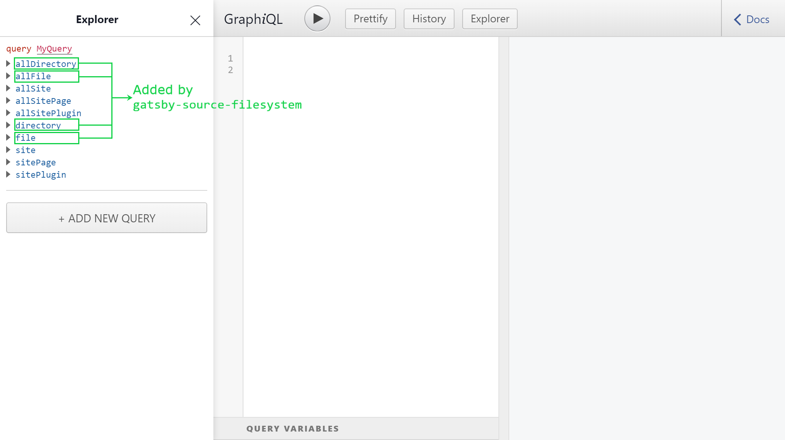

> If Gatsby is new to you, check out my previous post, [Why My Blog Is Built with Gatsby](../why-my-blog-is-built-with-gatsby), where I explain what Gatsby is, how it works and the thinking behind why I chose to use it to build my site.

Over the past weeks, I've been ~~building my personal site to play with Gatsby~~ playing with Gatsby to build my personal site. It's been painless so far. But as with any personal project, one of the challenges is really taking the first step. Fortunately, for Gatsby, the first step of getting a website up and running takes only a matter of seconds.

## Up and running in seconds

Provided that you have Git and npm already installed, getting a site running with Gatsby is as fast as running these:

```bash{1,2,4}
npm install -g gatsby-cli
gatsby new my-hello-world-site https://github.com/gatsbyjs/gatsby-starter-hello-world
cd my-hello-world-starter/
gatsby develop
```

First, we install `gatsby-cli` globally. This makes the `gatsby` command line tool available for use throughout the different steps in the development process. These include pulling boilerplate code, starting a development server, building the website, or deploying to a web host. 

Next, using the freshly-installed `gatsby` command, we create a new Gatsby project in a directory called `my-hello-world-site`. The project will be cloned from a starter called `gatsby-starter-hello-world`.

"What's a starter?" you might ask. They are just Git projects created and maintained by the community to help people jump-start their development quickly. They already contain an initial working code for a website that you can further tweak to your liking. There are starters for all sorts of purposes, such as blogs, portfolios, docs and eCommerce. If you plan on making a specific website, chances are there are already starters for your use case in the [Starter Library](https://www.gatsbyjs.org/starters/?v=2).

In our example, we are using the official `gatsby-starter-hello-world`, which is the most bare-bones starter I can find. It just shows _Hello world!_ on a plain white index page.

The last step is to run `gatsby develop` inside the root directory of `my-hello-world-site` project we just created. This starts a 'development' version of the website, on [http://localhost:8000/](http://localhost:8000/) by default. You can then open this URL in the browser to see changes reflected whenever you tweak the code.


With those easy steps, you are pretty much all set to start developing.


## Adding pages

The most straightforward way to add pages is to create React components inside `src/pages`. At build time, Gatsby core automatically renders them into pages with the path based on the filename. For example, a component in `src/pages/blog.js` turns into a page in `/blog`.

Here's a sample React component.

```jsx{5,6}
import React from "react"

export default () => (
    <div>
        <h1>Welcome to my blog!</h1>
        <p>The spectacle before us was indeed sublime.</p>
    </div>
)
```

If you are not familiar with the syntax, this is just JavaScript at its core. It uses an [arrow function](https://developer.mozilla.org/en-US/docs/Web/JavaScript/Reference/Functions/Arrow_functions) that returns a React element in [JSX](https://reactjs.org/docs/introducing-jsx.html) syntax.

Copy the code to `src/pages/blog.js`. Then, if you haven't yet, run `gatsby develop`. You'll see in [http://localhost:8000/blog](http://localhost:8000/blog) the rendered version of the React component.


## Creating pages from a data source

Often, you would need to create pages from a source programmatically.

For example, you have thousands of Markdown files and each will be generated as a page. You somehow need to read the data from the files and convert them to HTML so that they can be rendered as pages. You would also prefer using a single template and just use that to create all the pages.

The previous approach would no longer cut it. Typically, this is the recipe you need to follow:

  1. Pull data from a source
  2. Transform data to a usable form, if necessary
  3. Create the pages by plugging in queried data to a template


## Pulling data from Markdown files

When the contents of your pages need to be fetched from some source, you'll most likely need a _source plugin_. If you need to fetch from the Wordpress API, there's a Wordpress source plugin. If you need to pull data from a MongoDB collection, there's a MongoDB source plugin. You can search the [Gatsby Plugin Library](https://www.gatsbyjs.org/plugins/) for the plugin that will do the job. Just search _gatsby-source-_, as this is the convention for naming source plugins.

For our Markdown files, `gatsby-source-filesystem` is the one. It just pulls data from the local filesystem. Let's play with it.

First step is to install it.

```shell
npm install gatsby-source-filesystem
```

Next, you have to declare your intent to use it by adding it as a plugin in `gatsby-config.js`. In the code below, we are also instructing the plugin to read files inside `content/blog` directory.

```js{3-9}
module.exports = {
  plugins: [
    {
      resolve: `gatsby-source-filesystem`,
      options: {
        name: `src`,
        path: `${__dirname}/content/blog`,
      },
    },
  ],
}
```

Of course, we have to create `content/blog` directory. We'll put Markdown files there later.

Run `gatsby develop` to initiate the bootstrapping sequence. Part of what happens in this process are, in order:

  1. Gatsby loads plugins listed in `gatsby-config.js`
  2. Loaded source plugins are invoked to pull data into GraphQL

GraphQL manages the data for Gatsby. It normalizes data pulled from different sources so that we can query them in a standard expressive manner before we supply them to our pages. Note that it only exists at build-time, not when the site is already live.

After `gatsby develop` is done, open [http://localhost:8000/___graphql](http://localhost:8000/___graphql). This is the link to _GraphiQL_, the in-browser GraphQL IDE, where we can explore available data and run queries.

In the Explorer section on the left side are the available _schemas_ that can be queried. The schemas highlighted in green are those created by `gatsby-source-filesystem`.



You can use Explorer to view schemas, and the properties that can be queried. In this example, we are querying for the `birthTime` and `publicURL` of all the file nodes gathered by `gatsby-source-filesystem`, which it stores in `allFile` schema.


As you click the properties in Explorer, the query is already being formed. You just have to hit the 'Play' ▶️ button to execute the query.

As expected, the list of file nodes are empty. This is because `content/blog` has no files yet. It's the directory where `gatsby-source-filesystem` is looking, because we declared so in `gatsby-config.js`.

Let's add a Markdown file in `content/blog` and name it `first-post.md`.

```md
---
title: My First Post
slug: my-first-post
date: 02 August 2019
excerpt: Hi. I'm new to this blogging thing.
---

Hi. I'm new to this blogging thing.

But did you know that _blog_ is short for _weblog_?
```

Running the previous query in GraphiQL would now yield a result containing data about `first-post.md`.


## Transforming Markdown to HTML

Markdown is the preferred format for documentation in the software world these days. I personally love it because its simple, lightweight, and it allows a more focused writing experience.

To create webpages, however, you need to convert Markdown to HTML first. For example:
  - `# Hello` is converted to `<h1>Hello</h1>`
  - `[click me](https://example.com)` becomes `<a href='https://example.com'>click me</a>`

With Gatsby, in such cases when you need to modify raw data brought by _source plugins_ into a more workable form, you need to use _transformer plugins_. You can find a transformer plugin in the [Plugin Library](https://www.gatsbyjs.org/plugins/) or write your own.

For Markdown, you can use `gatsby-transformer-remark`. It uses the [Remark](https://remark.js.org/) Markdown parser. As with any Gatsby plugin, you need to install it first.

```shell
npm install gatsby-transformer-remark
```

Then, add it as a plugin in `gatsby-config.js`:

```js{10}
module.exports = {
  plugins: [
    {
      resolve: `gatsby-source-filesystem`,
      options: {
        name: `src`,
        path: `${__dirname}/content/blog`,
      },
    },
    `gatsby-transformer-remark`,
  ],
}
```

During bootstrapping, `gatsby-transformer-remark` processeses Markdown _nodes_ (i.e. data objects) that are loaded into the Gatsby data system by source plugins.

Trigger this sequence again by running `gatsby develop`. You'll notice in GraphiQL that there are two newly-added schemas. Both hold processed Markdown data, all in the perfect format we need to create pages.


I'm talking not just about the converted HTML content, but also some other nice stuff. If you notice, in `first-post.md`, there is some structured information at the beginning.

```md
---
title: My First Post
slug: my-first-post
date: 02 August 2019
excerpt: Hi. I'm new to this blogging thing.
---
```

This is called _frontmatter_, a section that contain useful metadata that describe that file. You can put arbitrary properties there as you wish. In this example, we added `title`, `slug`, `date` and `excerpt` information, because I think we will need it when we create the page.

This frontmatter is already parsed and made available for query by `gatsby-transformer-remark`. It also adds other cool bits like `timeToRead`, an estimate on how long it will take to read the post, [Medium](https://medium.com/)-style. Here's a sample query, where we get selected properties of each of the Markdown files processed by the transformer using the `allMarkdownRemark` schema.


At this point, you already have the data you need. It's just a matter of instructing Gatsby to create the pages.

## Creating pages using queried data

Gatsby initiates a specific sequence of steps during its lifecycle. It offers lifecycle APIs so that you can hook your own operations into this sequence.

On bootstrap and after sourcing and transformation of data, there is a part where Gatsby checks for an implementation of `createPages` in `gatsby-node.js`. If it finds one, it calls it. We'll use this hook to create our pages programmatically.

Create a file called `gatsby-node.js` in the root of the project. Inside it, export a `createPages` function that accepts an object containing `graphql` and `actions`. These two parameters are utilities passed on by Gatsby when it calls the `createPages` implementation.

```js
exports.createPages = ({ graphql, actions }) => {
  // Do something
}
```

Next, we have to query for all the posts using the `graphql` function passed by Gatsby. Let's get the `slug` property of each post, since we need something that will identify each one uniquely. `graphql` returns a [promise](https://developer.mozilla.org/en-US/docs/Web/JavaScript/Reference/Global_Objects/Promise) that, when fulfilled, passes along the result of the query. Let's log the result in the console.

```js{19}
exports.createPages = ({ graphql, actions }) => {
  return graphql(`
    query {
      allMarkdownRemark {
        edges {
          node {
            frontmatter {
              slug
            }
          }
        }
      }
    }
  `).then(result => {
    if (result.errors) {
      throw result.errors
    }

    console.log(JSON.stringify(result, null, 2))
  })
}
```

When you execute `gatsby develop`, you should see the result logged:

```json
{
  "data": {
    "allMarkdownRemark": {
      "edges": [
        {
          "node": {
            "frontmatter": {
              "slug": "my-first-post"
            }
          }
        }
      ]
    }
  }
}
```

The `edges` array contains the individual posts. By iterating over the each `node` in this array through `Array.map`, we can get the `slug` value and work on each post.

```js{19-21}
exports.createPages = ({ graphql, actions }) => {
  return graphql(`
    query {
      allMarkdownRemark {
        edges {
          node {
            frontmatter {
              slug
            }
          }
        }
      }
    }
  `).then(result => {
    if (result.errors) {
      throw result.errors
    }

    result.data.allMarkdownRemark.edges.map(({ node }) => {
      const slug = node.frontmatter.slug
    })
  })
}
```

Apart from the slug, we also need to create a page template. When creating a page programmatically, Gatsby needs a React component that will define the structure of the page, given some context data.

Create a new directory named `src/templates`. Then, add this in a file called `src/templates/blog-post.js`:

```jsx
import React from "react"

export default () => {
  return (
    <div>
      <div>Hi! This is a blog post.</div>
    </div>
  )
}
```

Now that we have the stuff ready, let's create a page for each post. This is done using one of the `actions` provided by Gatsby to our `createPages` function. The `actions` object is actually a collection of functions that we can use to change state on our site. The specific function we need is `createPage`. We can extract it by destructuring the object.

```js{2}
exports.createPages = ({ graphql, actions }) => {
  const { createPage } = actions

  return graphql(`
    query {
      allMarkdownRemark {
        edges {
          node {
            frontmatter {
              slug
            }
          }
        }
      }
    }
  `).then(result => {
    if (result.errors) {
      throw result.errors
    }

    result.data.allMarkdownRemark.edges.map(({ node }) => {
      const slug = node.frontmatter.slug
    })
  })
}
```

When calling `createPage`, you need to specify the path for the page, the component page template and some context data for the page. The `path` should start with a forward slash. The `component` should be an absolute path, so we'll use the Node.js `Path` module to resolve it. `context` is where you put data that identifies or tells something about the page. It will be used as GraphQL variables in page queries. For this, we are putting `slug` since it distinguishes one post from another.

```js{1,25-31}
const path = require(`path`)

exports.createPages = ({graphql, actions}) => {
  const { createPage } = actions

  return graphql(`
    query {
      allMarkdownRemark {
        edges {
          node {
            frontmatter {
              slug
            }
          }
        }
      }
    }
  `).then(result => {
    if (result.errors) {
      throw result.errors
    }

    result.data.allMarkdownRemark.edges.map(({ node }) => {
      const slug = node.frontmatter.slug
      createPage({
        path: `/${slug}`,
        component: path.resolve('./src/templates/blog-post.js'),
        context: {
          slug: `${slug}`,
        },
      })
    })
  })
}
```

Now, it's time to tweak the template, `blog-post.js`. First, we need to specify the page query.

On bootstrap, Gatsby extracts page queries from the `query` property exported by the component. You need to use the `graphql` tag function and specify the query in-between the backticks. Gatsby runs this query, and passes the result to the render function as the `data` property.


```jsx{2,4-14,16-17}
import React from "react"
import { graphql } from "gatsby"

export const query = graphql`
  query($slug: String!) {
    markdownRemark(frontmatter: {slug: {eq: $slug}}) {
      timeToRead
      html
      frontmatter {
        date
        excerpt
        title
      }
    }
  }
`

export default ({ data }) => {
  console.log(data)
  return (
    <div>
      <div>Hi! This is a blog post.</div>
    </div>
  )
}
```

Inside the render function is where you define the structure of the page using the `data` passed. In this example, we display the `title` as a header, show the `date` and `timeToRead` as subheader and the `html` as paragraph.

```jsx{19-27}
import React from "react"
import { graphql } from "gatsby"

export const query = graphql`
  query($slug: String!) {
    markdownRemark(frontmatter: {slug: {eq: $slug}}) {
      timeToRead
      html
      frontmatter {
        date
        excerpt
        title
      }
    }
  }
`

export default ({ data }) => {
  const post = data.markdownRemark
  return (
    <div>
      <h1>{ post.frontmatter.title }</h1>
      <h5>{ post.frontmatter.date } | { post.timeToRead }-minute read</h5>

      <p dangerouslySetInnerHTML={{ __html: post.html }}></p>
    </div>
  )
}
```

Finally, you can now see our programmatically created page in `/my-first-post`.


Let's add another Markdown in `content/blog` called `sorrows-of-young-werther.md`.

```md
---
title: The Sorrows of Young Werther
slug: sorrows-of-young-werther
date: 19 August 2019
excerpt: This content was generated by blindtextgenerator.com
---

A wonderful serenity has taken possession of my entire soul, like these sweet mornings of spring which I enjoy with my whole heart. I am alone, and feel the charm of existence in this spot, which was created for the bliss of souls like mine.
```

Since we already did all the dirty work, we can instantly see this Markdown rendered as a page in `/sorrows-of-young-werther`.


From here on, you can add more Markdown posts in `content/blog`. They will be rendered automatically without needing to add any code. In case you want to change the layout or design of your posts, you can simply tweak the page template.

