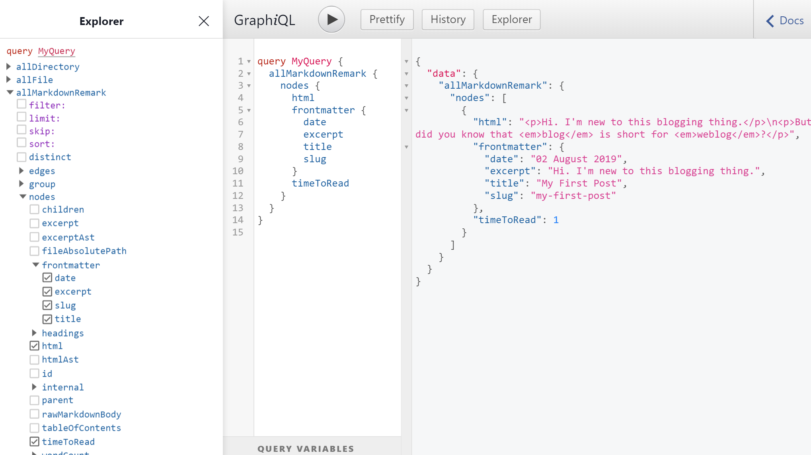

Over the past weeks, I've been ~~building my personal site to play with Gatsby~~ playing with Gatsby to build my personal site. It's been painless so far. But as with any personal project, one of the challenges is really taking the first step. Fortunately, for Gatsby, the first step of getting a website up and running takes only a matter of seconds.

> If Gatsby is new to you, check out my previous post, [Why My Blog Is Built with Gatsby](../why-my-blog-is-built-with-gatsby), where I explain what Gatsby is, how it works and the thinking behind why I chose to use it to run my site.

## Up and running in seconds

Provided that you have Git and npm already installed, getting a site running with Gatsby is as fast as running the commands in this block:

```bash{1,2,4}
npm install -g gatsby-cli
gatsby new my-hello-world-site https://github.com/gatsbyjs/gatsby-starter-hello-world
cd my-hello-world-starter/
gatsby develop
```

First, we install `gatsby-cli` globally. This makes the `gatsby` command line tool available for use throughout the different steps in the development process. These include pulling boilerplate code, starting a development server, building the website, or deploying to a web host. 

Next, using the freshly installed `gatsby` command, we create a new Gatsby project in a directory called `my-hello-world-site`. The project will be cloned from a starter called `gatsby-starter-hello-world`.

"What's a starter?" you might ask. They are just Git projects created and maintained by the community to help people jump-start their development quickly. They already contain an initial working code for a website that you can further tweak to your liking. There are starters for all sorts of purposes, such as blogs, portfolios, docs and eCommerce. If you plan on making a specific website, chances are there are already starters for your use case in the [Starter Library](https://www.gatsbyjs.org/starters/?v=2).

In our example, we are using the official `gatsby-starter-hello-world`, which is the most bare-bones starter I can find. It just shows 'Hello world!' on a clean white page.

The last step is to run `gatsby develop` inside the root directory of `my-hello-world-site` project we just created. This starts a 'development' version of the website, on [http://localhost:8000/](http://localhost:8000/) by default. You can then open this URL in the browser to see changes reflected whenever you tweak the code.


With those easy steps, you are pretty much all set to start developing.


## Adding pages

The most straightforward way to add pages is to create React components inside `src/pages`. At build time, Gatsby core automatically renders them into pages with the path based on the filename. For example, a component in `src/pages/blog.js` turns into a page in `/blog`.

Here's a sample React component.

```jsx{5,6}
import React from "react"

export default () => (
    <div>
        <h1>Welcome to my blog!</h1>
        <p>The spectacle before us was indeed sublime.</p>
    </div>
)
```

If you are not familiar with the syntax, this is just JavaScript at its core. It uses an [arrow function](https://developer.mozilla.org/en-US/docs/Web/JavaScript/Reference/Functions/Arrow_functions) that returns a React element in [JSX](https://reactjs.org/docs/introducing-jsx.html) syntax.

Copy the code to `src/pages/blog.js`. Then, if you haven't yet, run `gatsby develop`. You'll see in [http://localhost:8000/blog](http://localhost:8000/blog) the rendered version of the React component.


## Creating pages from a data source

Often, you would need to create pages from a source programmatically.

For example, you have thousands of Markdown files and each will be generated as a page. You somehow need to read the data from the files and convert them to HTML so that they can be rendered as pages. You would also prefer using a single template and just use that to create all the pages.

The previous approach would no longer cut it. Typically, this is the recipe you need to follow:

  1. Pull data from a source
  2. Transform data to a usable form, if necessary
  3. Create the pages by plugging in queried data to a template


## Pulling data from Markdown files

When the contents of your pages need to be fetched from some source, you'll most likely need a _source plugin_. If you need to fetch from the Wordpress API, there's a Wordpress source plugin. If you need to pull data from a MongoDB collection, theres a MongoDB source plugin. You can search the [Gatsby Plugin Library](https://www.gatsbyjs.org/plugins/) for the plugin that will do the job. Just search _'gatsby-source-'_, as this is the convention for naming source plugins.

For our Markdown files, `gatsby-source-filesystem` is the one. It just pulls data from the local filesystem. Let's play with it.

First step is to install it.

```shell
npm install gatsby-source-filesystem
```

Next, you have to declare your intent to use it by adding it as a plugin in `gatsby-config.js`. In the code below, we are also instructing the plugin to read files inside `content/blog` directory.

```js{3-9}
module.exports = {
  plugins: [
    {
      resolve: `gatsby-source-filesystem`,
      options: {
        name: `src`,
        path: `${__dirname}/content/blog`,
      },
    },
  ],
}
```

Of course, we have to create `content/blog` directory. We'll put Markdown files there later.

Run `gatsby develop` to initiate the bootstrapping sequence. Part of what happens in this process are, in order:

  1. Gatsby loads plugins listed in `gatsby-config.js`
  2. Source plugins that were loaded are invoked to pull data into GraphQL

GraphQL manages the data for Gatsby. It normalizes data pulled from different sources so that we can query them in a standard expressive manner before we supply them to our pages. Note that it only exists at build-time, not when the site is already live.

After `gatsby develop` is done, open [http://localhost:8000/___graphql](http://localhost:8000/___graphql). This is the link to GraphiQL, the in-browser GraphQL IDE, where we can explore available data and run queries.

In the Explorer section on the left side are the available _schemas_ that can be queried. The schemas highlighted in green are those created by `gatsby-source-filesystem`.


You can use Explorer to view schemas, and the properties that can be queried. In this example, we are querying for the `birthTime` and `publicURL` of all the file nodes gathered by `gatsby-source-filesystem`, which it stores in `allFile` schema.


As you click the properties in Explorer, the query is already being formed. You just have to hit the 'Play' ▶️ button to execute the query.

As expected, the list of file nodes are empty. This is because `content/blog` has no files yet. It's the directory where `gatsby-source-filesystem` is looking, because we said so in `gatsby-config.js`.

Let's add a Markdown file in `content/blog` and name it `first-post.md`.

```md
---
title: My First Post
date: 02 August 2019
excerpt: Hi. I'm new to this blogging thing.
---

Hi. I'm new to this blogging thing.

But did you know that _blog_ is short for _weblog_?
```

Running the previous query in GraphiQL would now yield a result containing data about `first-post.md`.


## Transforming Markdown to HTML

Markdown is the preferred format for documentation in the software world these days. I personally love it because its simple, lightweight, and it allows a more focused writing experience.

To create webpages, however, you need to convert Markdown to HTML first. For example:
  - `# Hello` is converted to `<h1>Hello</h1>`
  - `[click me](https://example.com)` becomes `<a href='https://example.com'>click me</a>`

With Gatsby, in such cases when you need to modify raw data brought by _source plugins_ into a more workable form, you need to use _transformer plugins_. You can find a transformer plugin in the [Plugin Library](https://www.gatsbyjs.org/plugins/) or write your own.

For Markdown, you can use `gatsby-transformer-remark`. It uses the [Remark](https://remark.js.org/) Markdown parser. As with any Gatsby plugin, you need to install it first.

```shell
npm install gatsby-transformer-remark
```

Then, add it as a plugin in `gatsby-config.js`:

```js{10}
module.exports = {
  plugins: [
    {
      resolve: `gatsby-source-filesystem`,
      options: {
        name: `src`,
        path: `${__dirname}/content/blog`,
      },
    },
    `gatsby-transformer-remark`,
  ],
}
```

During bootstrapping, `gatsby-transformer-remark` processeses Markdown 'nodes' (or data objects) that are loaded into the Gatsby data system by source plugins.

Trigger this sequence again by running `gatsby develop`. You'll notice in GraphiQL that there are two newly-added schemas. Both hold processed Markdown data, all in the perfect format we need to create pages.


I'm talking about not just the converted content to HTML, but also some other nice stuff. If you notice, in `first-post.md`, there is some structured information at the beginning.

```md
---
title: My First Post
date: 02 August 2019
excerpt: Hi. I'm new to this blogging thing.
---
```

This is called 'frontmatter', a section that contain useful metadata that describe that file. You can put arbitrary properties there to your liking. In this example, we added `title`, `date` and `excerpt` information, because I think we will need it when we create the page.

This frontmatter is already parsed and made available for query by `gatsby-transformer-remark`. It also adds other cool bits like `timeToRead`, an estimate on how long it will take to read the post, [Medium](https://medium.com/)-style. Here's a sample query, where we get selected properties of each of the Markdown files processed by the transformer using the `allMarkdownRemark` schema.



At this point, you already have the data you need. It's just a matter of instructing Gatsby to create the pages.

## Creating pages using queried data

## Creating an index page for all pages