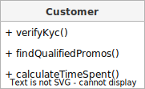
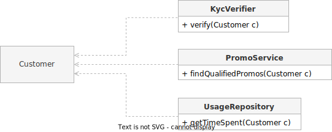

The Single Responsibility Principle (SRP) may be the most misunderstood [SOLID](https://en.wikipedia.org/wiki/SOLID) principle of object-oriented design, so much so that Robert C. Martin (aka Uncle Bob), the proponent of these authoritative principles, published a [blog post](https://blog.cleancoder.com/uncle-bob/2014/05/08/SingleReponsibilityPrinciple.html) in May of 2014 to clear the confusion.

The most intuitive interpretation of _responsibility_ in this context is a _job_. Classes have "jobs" to perform so it makes sense to argue that a class with _single responsibility_ means it has _one job_. It's easy to see how many people, including myself, would think of it that way. Search "[single responsibility principle one job](https://twitter.com/search?q=single%20responsibility%20principle%20one%20job&src=typed_query)" on Twitter and you'll see many think the same way, years after Uncle Bob's illuminating blog post. Therein lies a possible cause for misunderstanding.

## "This principle is about people"

In the book _Agile Software Development, Principles, Patterns, and Practices_ published in 2003, Uncle Bob [defined](https://drive.google.com/file/d/0ByOwmqah_nuGNHEtcU5OekdDMkk/edit?resourcekey=0-AbuGpXQzwZcUGExkktKt0g) the Single Responsibility Principle as:

> A class should have only one reason to change.

This is a more nuanced definition, steering away from the notion that a class should only have _one job_. A _responsibility_ is defined as a _reason for change_. If a class is likely to be affected in the future by change requests of differing reasons, the principle suggests that the responsibilities should be split to separate classes. When faced with real-world scenarios, though, I still found this definition hard to grasp and apply.

What helped create a better mental model for me personally is captured in this statement from Uncle Bob's aforementioned blog post that followed over a decade after the book:

> This principle is about people.

A _responsibility_ is an obligation _to_ someone. A _responsibility_ represents a person or group of people to which the program responds and is liable to. If we look at it this way, we can define the principle as:

> A class should be responsible to only one _actor_.

We can think of an actor as a person or group of people that is a part of a single business function. Actors are stakeholders who have skin in the game. They are responsible for the failures of their respective domains. That's why they request features or ask us programmers to fix a bug. They are the reasons for change.

## The `Customer` example

Suppose we are developers of an app for a bank. We have a `Customer` class that maintains basic customer information and supports three methods:

- The `verifyKyc` method verifies the customer's legitimacy and suitability according to the [KYC](https://en.wikipedia.org/wiki/Know_your_customer) guidelines for compliance purposes
- `findQualifiedPromos` searches for promos that the customer is qualified to avail according to the guidelines specified by the Marketing Team
- The `calculateTimeSpent` method returns the total time spent by the customer and is used by the Product Team to make data-driven decisions

Then, let's say all of the following events happened today:

- The new feature requested by the Compliance Team to integrate to a third-party KYC data vendor is not working as expected. There's a chance that we are allowing money-launderers to use the bank. The _Chief Compliance Officer_ (CCO) is under pressure.

- There was an issue that cost the company $10M because we allowed plenty of cutomers to use promos they weren't supposed to. Who is in the hot seat? The _Chief Marketing Officer_ (CMO) who heads the Marketing Team.

- The bug fix for the promos issue caused a side effect in calculating the time spent because they shared the same private helper method which was modified. Now, the _Chief Product Officer_ (CPO) is alarmed (falsely) that the metrics is showing very low usage on peak hours.

Notice that three (3) C-level execs are about to get us fired. LOL. This is an exaggerated example but it begs the question: _to whom is this class responsible to?_ There are three business functions that have a stake in this class. The class will change based on the interests of three different actors.

Thus, SRP suggests to split the class. There are many ways to do this. Here's a good start:

    

`Customer` keeps the basic customer information while the different responsibilities are distributed to three separate classes.

If, for example, the Marketing Team requests a feature to allow certain promos to be applied only to specific customers, the business logic will be right at home in `PromoService`, which deals with matters concerning the Marketing Team's promos.

    

Over time, each class will grow in complexity on their own while still catering to a single actor. Not only is the code less coupled, but we are also not introducing needless complexity and over-fragmenting code (which leads to [this nightmare](https://softwareengineering.stackexchange.com/questions/150760/single-responsibility-principle-how-can-i-avoid-code-fragmentation)).

## TL;DR

The common misconception about the Single Responsibility Principle (SRP) is that it demands a class to do _one job_. It is important to clarify that _responsibility_ in this context doesn't mean a _job_ or a _thing to do_. It means _reason for change_ or simply put, an _actor to whom the class is responsible to_. This distinction is important in understanding how SRP can help achieve the balance between maintainability and needless complexity.
